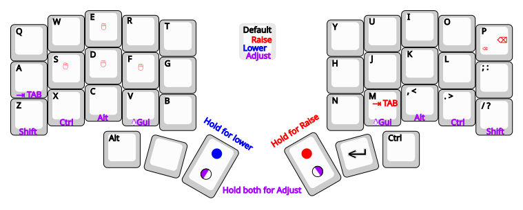
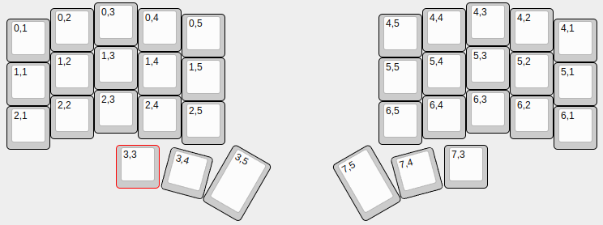

I realised that I actually don't quite use VIAL, so I decided
to de-clutter my layout to be QMK only.
The old VIAL stuff can be found in vial. Branch.

## Setting up
Install QMK following https://docs.qmk.fm/newbs_getting_started
```
qmk config user.keyboard=crkbd
qmk config user.keymap=andruhon
qmk new-keymap -kb crkbd
```

## Compile
My controller is promicro_rp2040, so I have to use CONVERT_TO,
to make sure the uf2 file produced.
```
qmk compile -kb crkbd -km andruhon -e CONVERT_TO=promicro_rp2040
```

## Flash
My controller is promicro_rp2040, so I have to use CONVERT_TO,
to make sure the uf2 file is flashed to RPI-RP2.

EE_HANDS is enabled, so both halves may be flashed.

Flash left:
```
qmk flash -kb crkbd -km andruhon -bl uf2-split-left -e CONVERT_TO=promicro_rp2040
```

Flash right:
```
qmk flash -kb crkbd -km andruhon -bl uf2-split-right -e CONVERT_TO=promicro_rp2040
```

## Keyboard matrix and layout

### Layout
WIP, check [keymap.c](keymap.c) for full layout for now.


### Matrix
Generated with http://www.keyboard-layout-editor.com/.
See also [Matrix](matrix.json)

