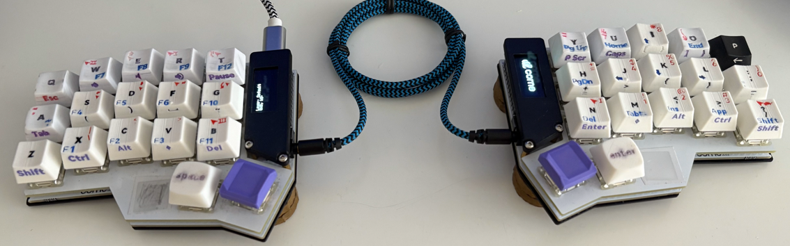

# TypeS Tri Layout
34 Keys [Tri Layout](https://docs.qmk.fm/features/tri_layer) for QMK optimized for TypeScript and Java.
I use it with Corne, but I can't see why this can't be used with other 36/34 keys keyboard.

This layout has [customizable keycaps](https://github.com/andruhon/super-custom-keycaps) project optimized for 3D printing  
https://github.com/andruhon/super-custom-keycaps



## Setting up
### Install QMK
Install QMK following https://docs.qmk.fm/newbs_getting_started
TLDR
```
sudo pacman --needed --noconfirm -S git python-pip libffi
python3 -m pip install --user qmk
qmk setup -b 0.28.0
see clonning into /home/user/yourdir/qmk_firmware
```
Note `/home/user/yourdir/qmk_firmware` above is a directory where the qmk_firmware was cloned.

### Install Type-S Tri Layout
```
cd /home/user/yourdir/qmk_firmware
cd keyboards/crkbd/keymaps/

git clone git@github.com:andruhon/type-s-tri-layout.git typestrilayout

qmk config user.keyboard=crkbd
qmk config user.keymap=typestrilayout
```

## Compile
My controller is promicro_rp2040, so I have to use CONVERT_TO,
to make sure the uf2 file produced.
```
qmk compile -kb crkbd -km typestrilayout -e CONVERT_TO=promicro_rp2040
```

## Flash
My controller is promicro_rp2040, so I have to use CONVERT_TO,
to make sure the uf2 file is flashed to RPI-RP2.

EE_HANDS is enabled, so both halves may be flashed.

Flash left:
```
qmk flash -kb crkbd -km typestrilayout -bl uf2-split-left -e CONVERT_TO=promicro_rp2040
```

Flash right:
```
qmk flash -kb crkbd -km typestrilayout -bl uf2-split-right -e CONVERT_TO=promicro_rp2040
```

Be careful when plugging in and unplugging your keyboard halves during flashing, always 
unplub USB cable first and only then remove TRS/TRRS cable connecing halves.

## Keyboard matrix and layout

### Layout
WIP, check [keymap.c](keymap.c) for full layout for now.

### Matrix
Generated with http://www.keyboard-layout-editor.com/.
See also [Matrix](matrix.json)


### Notes
The old VIAL stuff can be found in [VIAL](https://github.com/andruhon/corne3x5/tree/vial) branch.
