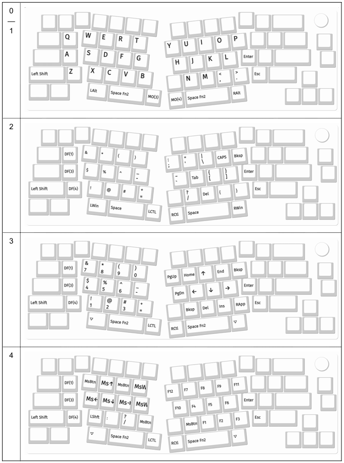

# Changelog

I was irritated by standard keyboards and mouses decades and tried many different things including MS Ergonomic keyboard and trackballs finding little satisfaction. Adesso WKB-3150UB keyboard with trackball was somewhat close, but still not good enough. 

## 26 Mar 2025
Finally produced image of the lyout (as a screenshot from OpenSCAD)

## 18 Mar 2025
Updated to QMK 0.28.0. There are mouse keycode changes.
Mouse codes are now prefixed with MS_, rather than with KC_.

## 16 Mar 2025
Renamed the project once again, I think it is the final.
The new name is TypeS Tri Layout, to emphasize that it is a QMK Tri Layot and that I 
mostly use it for writing TypeScript.

Keycaps are now https://github.com/andruhon/super-custom-keycaps

## 26 Feb 2025
Moved keycaps into a separate repo.

## 23 Feb 2025
Printed first keycaps on P1S with AMS with 0.2mm nozzle. They look really nice!

## 22 Oct 2024
Ordered to print my keykaps in Makerspace of local library. It took 10 days to get to the tip of the queue and get my first prototypes.
I started with flat keycaps from karlh5926 https://aileron.me/app/keycap , they look really nice and I can paint letter grooves with permanent markers or nail polish.
While they are nice keycaps with concave are a lot better to type on.

## 19 Oct 2024
I got sick of VIAL and converted layout to plain QMK.

## 15 Sep 2024
I reqlizes that extra keys in thumb cluster are only bringing confusion.
I pulled extra alt and ctrl switches from thumb clasters and plugged them with duct tape. 
Now the layOut is effectively 34 keys.

## 6 Aug 2024
Started making side stickers for keys to show extra action on them. This is a lot better than always looking for cheatsheet somewhere on the desk.

## 4 Aug 2024
I quickly came to conclusion that sixth columns are excessive and snapped them off. Shift on default layout is unnecessary with auto-shift on.

## 29 Jul 2024
I was tinkering with Keychron layout for some time and ended up with 37 keys layout, inspired by Matt Gemmell's Corne layout a lot.

The Shift as a 37 key sits on the layout because it was not possible to set up auto-shift in VIA without re-flashing the keyboard. This was all looking good so I ordered 42 keys Corne from https://github.com/klouderone

## 29 May 2024
Somewhere in early 2024 I decided that I need split keyboard like Corne, but cost of building one was rather repelling, so I decidet to first go with somewhat more or less industrially produced, so on 27 of May I have ordered  Keychron V8 QMK with brown switches. Keyboard arrived 3 days later and I started tinkering with VIA config in attempt to prove that 42 or 36 keys layout is usable.
