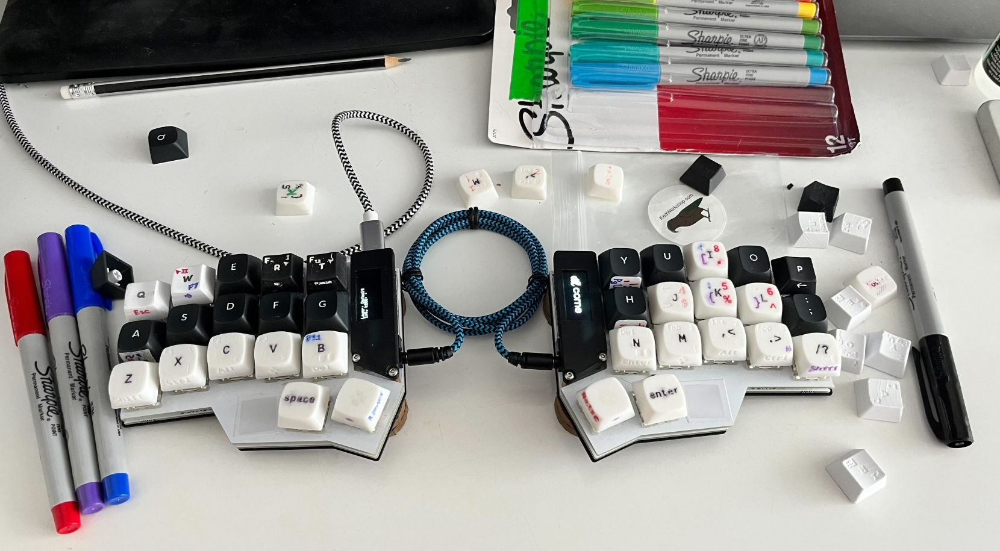

# Generating keycaps

Keycaps are at early prototyping stage. I will later organise and document everything properly.

*  [archive/keycap-edit-gui.scad](archive/keycap-edit-gui.scad) A slightly modified generator from  karlh5926@gmail.com (aileron.me). It generates keycaps with flat tops.
*  [cylindric-concave/newcaps.scad](cylindric-concave/newcaps.scad) A new generator which uses pre-generated stls for caps and can use SVGs for letters and symbols.
*  [archive/newcaps-poly.scad](archive/newcaps-poly.scad) A generator of compound caps to be assembled with [newcaps-poly-stems.scad](newcaps-poly-stems.scad). Assembling it from two parts hopefully allows these caps not to require colouring.
*  [polyhedron/polyhedron3-caps.scad](polyhedron/polyhedron3-caps.scad) An atttempt to build multicolour 3d print not needing colouring.

A photograph of different prototypes on my keyboard

* P,T and R are from newcaps.scad - illed with automotive enamel and sanded.
* zxcvbnmjkli and thumb cluster are from keycap-edit-gui.scad painted with ultra fine point permanent markers. These caps currently have some advantage that they do not need to be sanded - they come smooth enough by themselves, because they are flat.
* Q and W are also from newcaps.scad, but painted with permanent marker. Q first painted and sanded, P first sanded then painted. It is important to notice that layer lines work as capillary and suck all the paint, so it is preferrable to sand the button first.
* Black keys except R,T and P are Keychron caps.

Check the [/keycaps](/keycaps) it has some more open scad files, generated stl files to preview and SVGs.
