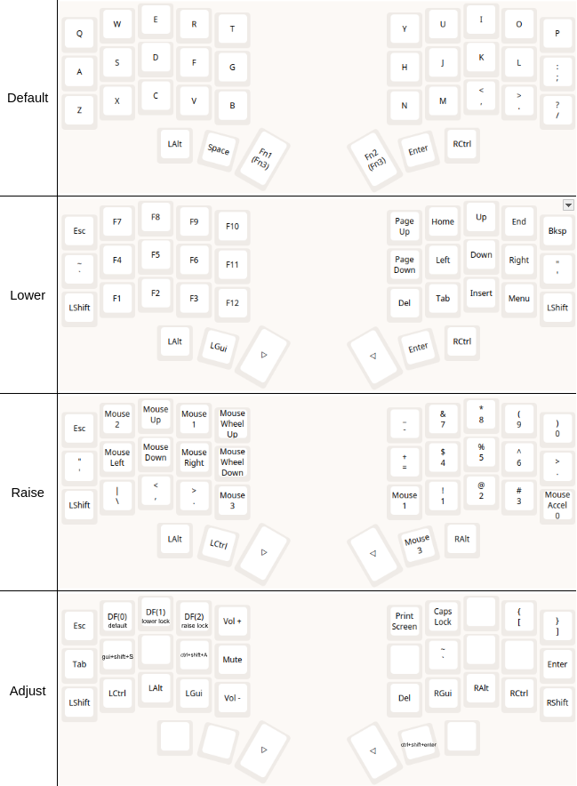

# Corne 3x5 VIAL layout

Building a 3x5 layout for my https://github.com/klouderone/cornev4promicroedition

Use on your risk.

My Corne is using Pro Micro controller. It needs double tap on reset to switch to bootloader mode.

I'm using IntelliJ IDEA in my work, and hoped to build layout convenient for me.
Default layout is conventional QUERTY, I still have to use my laptop, so I don't want to learn something non-QUERTY.

## Keyboard matrix

## Layout

## Build
cd to vial qmk `cd vial-qmk/` 
`make crkbd:vial CONVERT_TO=promicro_rp2040`

## Flash
* Unplug keyboard from USB; 
* Unplug TRRS or TRS cable; 
* Plug one side to USB; 
* My corne is using Pro Micro controller. It needs double tap on reset to switch to bootloader mode. 
* Once it is in bootloader mode the keyboard becomes available as new drive. uf2 file can be copied into this drive. 
* Repeat for another side.

## Links
https://mattgemmell.scot/the-corne-keyboard/
https://github.com/manna-harbour/miryoku
